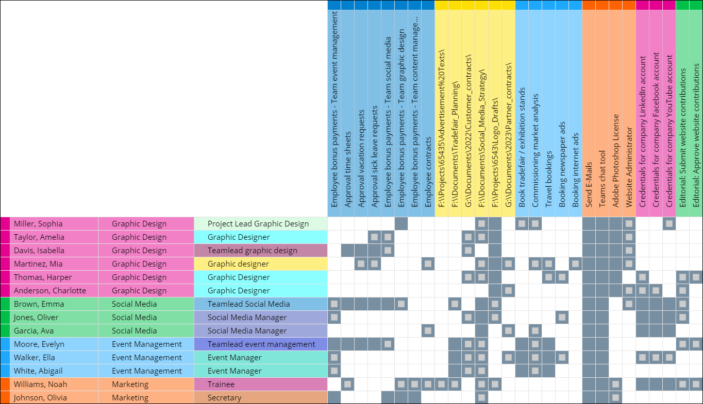
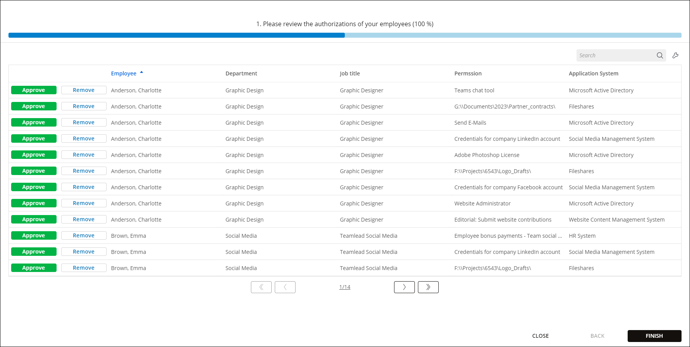
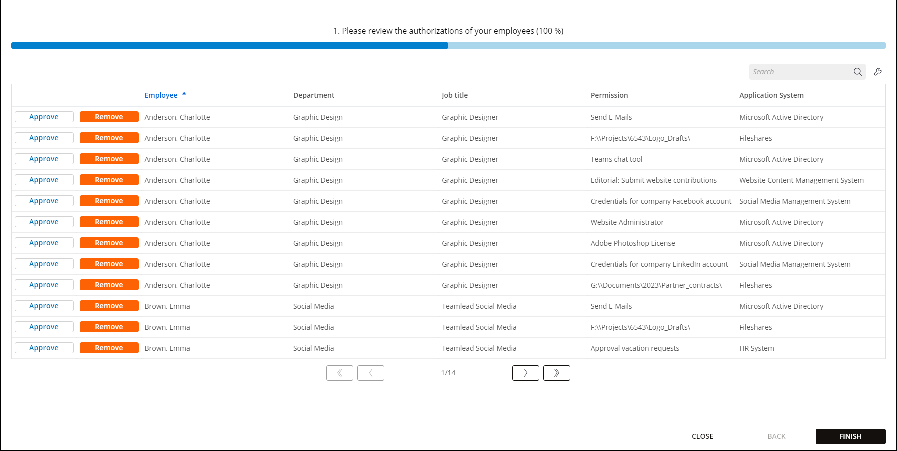
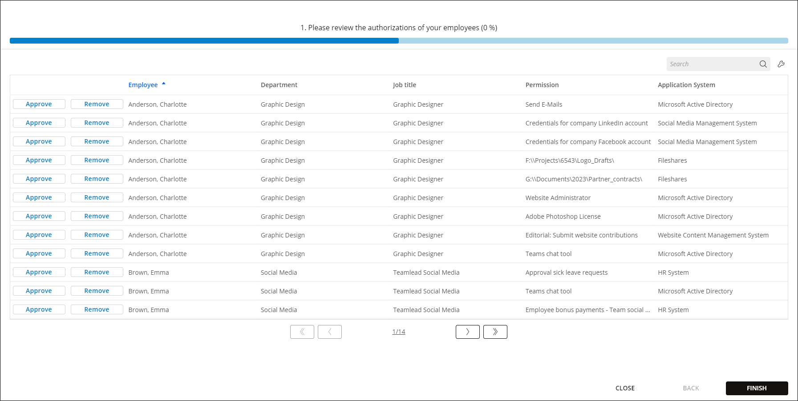
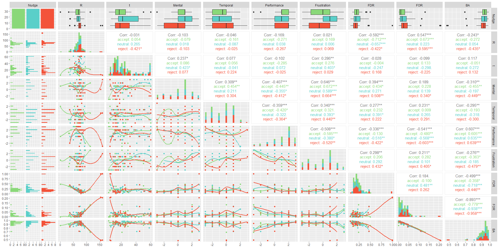

# Digital Nudges for Access Reviews

Access reviews are a compliance-driven evaluation to decrease excessive authorizations in organizations. As organizations only marginally revoke authorizations, we apply digital nudges to improve access reviews. Digital nudges are cues that guide decisions in a desired direction. This repository is part of a research project currently under review.

We first describe the [Structure](#1-structure-of-the-study) of the Study with the applied case study. Subsequently, we outline the [Results](#2-results-of-the-study) of the Study, including the results of all participants. Finally, we present the [Analysis](#3-analysis-of-the-study) of the Study with our code for the statistic software *[R](https://www.r-project.org/)*.

## Table of Contents
[1. Structure of the Study](#1-structure-of-the-study)  
[2. Results of the Study](#2-results-of-the-study)  
[3. Analysis of the Study](#3-analysis-of-the-study)

## 1. Structure of the Study

### Case Study

We designed an access review based on a case study: Participants are the access reviewers in a fictitious marketing department and have to evaluate the authorizations for all members. We created the following files to conduct the user study:

1. Instructions about the case study: [Instructions.md](/data/instructions/Instructions.md)
2. Employees in the fictitious marketing department: [Employees.csv](/data/case/Employees.csv)
3. Permissions of all employees: [Permissions.csv](/data/case/Permissions.csv)
4. Assignments to evaluate for every participant: [Assignments.csv](/data/case/Assignments.csv)

### Grid Figure Solution

Figure 1 displays the grid figure solution for the use case. **Blue fields** are true positives *(authorizations which should be granted and are granted)*, **blue fields with gray squares** are false positives *(authorizations are granted but should actually not be granted)*, and **white field** are true negatives *(these authorizations should not be granted and are not granted)*.

  

Figure 1: *Grid Figure with the solution of the use case*

### Screenshots of the User Study
              
  

Figure 2: *Default accept nudge in the user study*

 

  

Figure 3: *Default reject nudge in the user study*

 

Figure 4: *Neutral default nudge in the user study*

## 2. Results of the Study

For full transparency, we publish the anonymized results of the user study:

1. Results of the user study for each participant (n=102): [Participants.csv](/data/results/Participants.csv)
2. Decisions of the participants for the authorizations (n=16,320): [Decisions.csv](/data/results/Decisions.csv/)

## 3. Analysis of the Study

We used the statistic software *R* to analyze the user study results. Therefore, we created two files for *R*, which we provide for our results to be replicable:

1. Anova analysis of the user study: [Anova.r](/scripts/anova.r)
2. Pair plot generator for the results: [Pair-plot.r](/scripts/pair-plot.r)

Please install R v4.3.2 for replication. Add Rscript to your PATH variable if you run Microsoft Windows. Execute within the root directory of the repository:

1. `Rscript --vanilla scripts/anova.r` for testing ANOVA.
2. `Rscript --vanilla scripts/pair-plot.r` for generating the pair plot.

Figure 5 displays the generated pair plot.

  

Figure 5: *Pair plot with the analysis of the user study*
